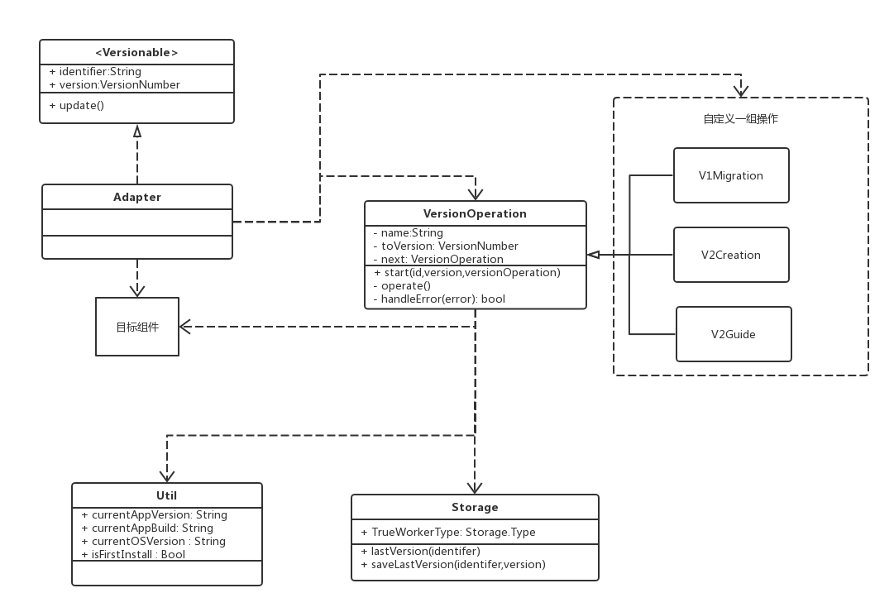
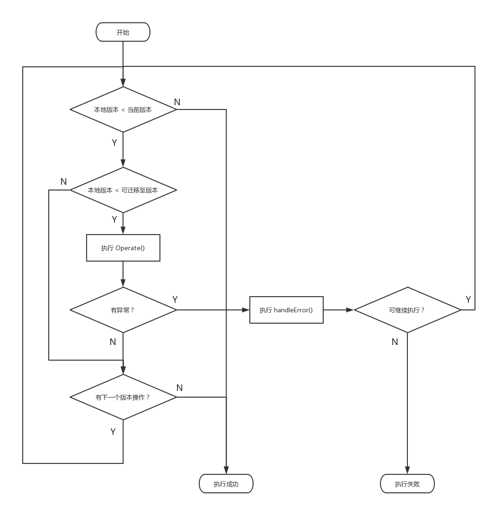

# YCIVersion

<!--[](https://travis-ci.org/YanChen-ing/YCIVersion)-->
[](https://cocoapods.org/pods/YCIVersion)
[](https://cocoapods.org/pods/YCIVersion)
[](https://cocoapods.org/pods/YCIVersion)

由于本地持久化存储数据，造成的需要进行版本管理组件或项目。

## 特性

- [x] 链式版本迁移操作管理，灵活添加，移除，修改版本操作
- [x] 可用于引导弹窗，一次性操作等
- [x] 支持某版本操作，每次升级版本都执行
- [x] 默认 UserDefaults 存储组件版本，存储策略可自定义
- [x] 支持一些如 isFirstInstall , currentAppVersion 等便捷查询

## 示例

### 迁移

swift:

```swift
    func migrating() {
        
        let startOperation = V2Migration()
        
        YCIVersion.VersionOperation.start(exampleIdentifer, version: 3, operation: startOperation)
        
    }

```
objective-c:

```objective-c
- (void)migrating{
    
    VersionOperation *startOperation = [[V1Creation alloc] init];
    
    [VersionOperation start:@"OC_example" version:3 operation:startOperation];
    
}

```

## 使用需求

## 安装

```ruby
source 'http://git.sogou-inc.com/YCIios/YCISpecs.git'
pod "YCIVersion"
```

## 使用

1.继承 `VersionOpreation`，示例：

```swift

// 引导弹层
class V2Guide: VersionOperation { 
    
    @objc public var vc: UIViewController?
    
    /// 通过闭包获取信息
    @objc public var vcDescription: (() -> String)?
    
    override init() {
        
        super.init()
        
        name = "v2 引导页"
        toVersion = 300  // 只要版本号小于300，则每次升级都执行操作
        
    }
    
    override func operate() throws {
        
        print("引导弹窗")
        
        let message = vcDescription?() ?? "这是个引导弹窗"
        
        let alert = UIAlertController.init(title: "V2", message: message, preferredStyle: .alert)
        
        alert.addAction(UIAlertAction(title: "取消", style: .cancel, handler: nil))
        
        vc?.present(alert, animated: true, completion: nil)
        
    }
    
//    override func handleError(_ error: Error) -> Bool {
//
//        print("处理异常：error" + error.localizedDescription)
//
//        return true  // 错误无影响，可继续执行
//
//        //        return false // 终止后续执行
//    }
    

}
```

2.主应用启动时，启动组件，进行部分初始化操作。若在组件内，则不需要启动，在主应用内启动即可。主要是记录首次安装版本号。

```swift

    func application(_ application: UIApplication, didFinishLaunchingWithOptions launchOptions: [UIApplicationLaunchOptionsKey: Any]?) -> Bool {
        

        YCIVersionManager.update()
        
        return true
    }
```

3.合适位置启动操作链

```swift
YCIVersion.VersionOperation.start(exampleIdentifer, version: 3, operation: V2Migration())

```


## 原理

### 架构图


### 版本操作流程


## 解答

### 升级操作失败，如何处理？
升级失败，代表本地持久化文件，无法满足当前.ipa 运行条件，故调用 handleError ，由使用方处理，不做回滚或其他操作

### Storage 使用方是否可自定义？
使用方通过继承Storge，重写实现，并在启动迁移前更改`YCIVersion.Storage.TrueWorkerType`可修改全局唯一的存储方案，不建议修改

### 做为弹窗如何使用？
单独一个Operation 可以独立使用。根据需要继承并实现VersionOperation , 在需要的 VC 中创建并赋属性，使其在 Operate 方法中可以访问到 VC 中的属性，通过 闭包的方式，将一些 Operation 需要的回调实现。

### 本地没有任何记录，如何判定是否执行？
本地没有记录分为两种情况：

> * 首次安装
> 
> * 由以前版本升级
> 
> 

首次安装的情况，占打开比例极低，如果加过多的判断，一是增加复杂度，二是之后的启动增加了没必要的判断。所以这里使用如无本地版本记录，则默认为版本为0，需要执行迁移链所有操作。这对迁移链的操作提出更高要求，需要在操作前，先判断本地条件是否满足。


### 如何判断首次安装
 应用并集成YCIVersion 安装后，会在本地记录首次安装时的 Build 号。之后通过是否存在 Build 号来判断是否首次安装。
 
 
### 若某项操作，每次版本更新都需要执行，如何操作
 VersionOperation.toVersion 表示小于等于该版本都会执行。故只需要将toVersion 值设为 `VersionNumberMAX`即可


### 如果本地版本，小于迁移链最早版本
此时程序已经安装，本地原数据却无法迁移到新版本，必然造成运行问题。故应在升级前检查要升级的版本是否能够迁移。而且迁移链应该包含从 0 到 最新版的创建操作，否则在首次安装时，无法维护本地持久化需要的文件。

### 是否支持版本回滚操作，版本降级
程序已升级，本地持久化数据如果升级失败，不利于程序运行。如果需要回退，则意味着需要有备份，并在执行完成后再统一清除备份，当前轻量级中，暂不考虑

### 本模块需要
本模块也使用 版本链管理，实现 VersionOperation 协议。  
在使用时，先执行 `YCIVersion.Starter.update()` 对本模块进行升级操作    

首次执行时，将首次安装时的版本 build 记入 BZV_FirstInstall 


## Author

YanChen-ing, yanchen

